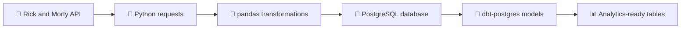
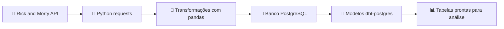

<a id="top"></a>

<h1 align="center">🛸 Rick and Morty Data Project</h1>

<p align="center">
  <strong>A Python data project prepared to collect, transform, and store Rick and Morty data using PostgreSQL and dbt.</strong>
</p>

<p align="center">
  <a href="#english">🇺🇸 English</a> •
  <a href="#portuguese">🇧🇷 Português</a>
</p>

<p align="center">
  
  
  
  
</p>

---

## 🌎 Choose your language

- [🇺🇸 Read in English](#english)
- [🇧🇷 Ler em Português](#portuguese)

---

<a id="english"></a>

# 🇺🇸 English

## 📌 Overview

**Rick_and_Morty** is a Python project designed to work as a data pipeline around the Rick and Morty universe. Based on the current project configuration, it is prepared for an **ETL/ELT workflow**:

1. 🧲 Extract data from an external API.
2. 🧹 Transform and organize the data with Python.
3. 🐘 Load the data into PostgreSQL.
4. 🧱 Use dbt with PostgreSQL for analytical modeling.

The dependency set indicates a data-oriented project using **requests**, **pandas**, **SQLAlchemy**, **psycopg2**, **python-dotenv**, and **dbt-postgres**.

> 🧪 **Current repository status:** the analyzed branch contains project metadata and dependency files, but no executable ETL entrypoint or dbt project structure is currently defined. This README documents the current setup and provides a complete recommended workflow for the project to evolve safely.

---

## ✨ Main Goals

This project is intended to help developers practice and demonstrate:

- 🧬 API data extraction.
- 🐼 Data manipulation with pandas.
- 🗄️ PostgreSQL database integration.
- 🔐 Safe local environment configuration with `.env`.
- 🧱 Analytics engineering concepts with dbt.
- 📦 Reproducible Python dependency management with `uv`.

---

## 🧰 Tech Stack

| Technology                     | Role in the Project                                             |
| ------------------------------ | --------------------------------------------------------------- |
| **Python 3.12+**               | Main programming language                                       |
| **uv**                         | Dependency resolution and lockfile-based environment management |
| **requests**                   | HTTP client for API calls                                       |
| **pandas**                     | Data transformation and tabular data processing                 |
| **SQLAlchemy**                 | Database engine and SQL abstraction layer                       |
| **psycopg2 / psycopg2-binary** | PostgreSQL driver                                               |
| **python-dotenv**              | Loads environment variables from `.env`                         |
| **PostgreSQL**                 | Target relational database                                      |
| **dbt-postgres**               | dbt adapter for PostgreSQL transformations                      |
| **logging**                    | Application logging and execution monitoring                    |

---

## 📁 Confirmed Project Structure

The current repository configuration indicates the following confirmed structure:

```text
Rick_and_Morty/
├── README.md           # Project documentation
├── pyproject.toml      # Python project metadata and dependencies
├── uv.lock             # Locked dependency graph generated by uv
├── .python-version     # Python version used by the project
└── .gitignore          # Ignored Python artifacts, virtual envs, and .env files
```

Recommended future structure:

```text
Rick_and_Morty/
├── src/
│   ├── extract.py      # API extraction logic
│   ├── transform.py    # Data cleaning and transformation logic
│   ├── load.py         # PostgreSQL loading logic
│   ├── database.py     # Database connection helpers
│   └── main.py         # Pipeline entrypoint
├── dbt/
│   ├── dbt_project.yml
│   └── models/
├── tests/
├── .env.example
├── pyproject.toml
├── uv.lock
└── README.md
```

---

## 🏗️ Suggested Architecture



---

## ⚙️ Requirements

Before running the project, make sure you have:

- Python **3.12+**
- PostgreSQL installed and running
- `uv` installed
- Git installed
- A local `.env` file with database credentials

Install `uv` if needed:

```bash
pip install uv
```

---

## 🔐 Environment Variables

Create a local `.env` file in the project root:

```env
DB_USER=postgres
DB_PASSWORD=your_password_here
DB_HOST=localhost
DB_PORT=5432
DB_NAME=rick_and_morty
```

> ⚠️ Never commit your `.env` file. It should contain local credentials only. Use `.env.example` for shared configuration templates.

Recommended `.env.example` file:

```env
DB_USER=
DB_PASSWORD=
DB_HOST=localhost
DB_PORT=5432
DB_NAME=rick_and_morty
```

---

## 🚀 Installation

Clone the repository:

```bash
git clone https://github.com/Davi-SR/Rick_and_Morty.git
cd Rick_and_Morty
```

Create and synchronize the virtual environment with `uv`:

```bash
uv sync
```

Activate the virtual environment:

### Linux/macOS

```bash
source .venv/bin/activate
```

### Windows PowerShell

```powershell
.venv\Scripts\Activate.ps1
```

---

## 🐘 PostgreSQL Setup

Create the database:

```bash
createdb rick_and_morty
```

Or using `psql`:

```sql
CREATE DATABASE rick_and_morty;
```

Check the connection:

```bash
psql -h localhost -U postgres -d rick_and_morty
```

---

## ▶️ Running the Project

At the moment, there is no executable entrypoint declared in the project configuration.

Once an ETL script is added, run it with:

```bash
uv run python src/main.py
```

Suggested execution flow:

```text
extract API data
        ↓
transform into clean tabular datasets
        ↓
load into PostgreSQL
        ↓
run dbt transformations
        ↓
query analytics-ready tables
```

---

## 🧱 dbt Usage

The project already declares `dbt-postgres` as a dependency, which prepares the environment for dbt + PostgreSQL workflows.

After adding a dbt project, validate the connection:

```bash
dbt debug
```

Run models:

```bash
dbt run
```

Test models:

```bash
dbt test
```

Recommended dbt model layers:

```text
models/
├── staging/
│   ├── stg_characters.sql
│   ├── stg_episodes.sql
│   └── stg_locations.sql
├── intermediate/
└── marts/
```

---

## 🗃️ Suggested Data Model

A practical Rick and Morty data warehouse can start with:

| Table               | Description                                                                        |
| ------------------- | ---------------------------------------------------------------------------------- |
| `characters`        | Character profile data such as name, status, species, gender, origin, and location |
| `episodes`          | Episode information such as name, code, air date, and related characters           |
| `locations`         | Locations, dimensions, and resident relationships                                  |
| `character_episode` | Many-to-many relationship between characters and episodes                          |

---

## 🧪 Quality and Testing Recommendations

Add automated tests for:

- ✅ API response validation
- ✅ Data transformation rules
- ✅ Database connection creation
- ✅ Insert/update behavior
- ✅ dbt model tests
- ✅ Null, uniqueness, and relationship checks

Recommended tools:

```bash
uv add pytest ruff
```

Suggested commands:

```bash
uv run pytest
uv run ruff check .
```

---

## 🛡️ Security Notes

- Never commit real credentials.
- Keep `.env` ignored by Git.
- Use `.env.example` for documentation only.
- Prefer strong local database passwords.
- Rotate any credentials that were accidentally committed.
- Avoid exposing database ports publicly.

---

## 🧭 Roadmap

- [ ] Add `src/` folder with ETL modules.
- [ ] Add a pipeline entrypoint such as `src/main.py`.
- [ ] Add `.env.example`.
- [ ] Add PostgreSQL schema creation scripts.
- [ ] Add dbt project files.
- [ ] Add tests with `pytest`.
- [ ] Add code quality tools such as `ruff`.
- [ ] Add CI workflow with GitHub Actions.
- [ ] Add usage examples and screenshots.
- [ ] Add a project license.

---

## 🤝 Contributing

Contributions are welcome! Suggested contribution flow:

1. Fork the repository.
2. Create a feature branch.
3. Make your changes.
4. Run tests and format checks.
5. Open a pull request.

```bash
git checkout -b feature/my-feature
git commit -m "feat: add my feature"
git push origin feature/my-feature
```

---

## 📄 License

No license file was detected during the repository review. Add a `LICENSE` file if the project will be distributed as open source.

---

## 👨‍💻 Author

Developed by **Davi-SR**.

Repository: `Davi-SR/Rick_and_Morty`

[⬆ Back to top](#top)

---

<a id="portuguese"></a>

# 🇧🇷 Português

## 📌 Visão Geral

**Rick_and_Morty** é um projeto em Python preparado para funcionar como um pipeline de dados inspirado no universo de Rick and Morty. Com base na configuração atual do projeto, ele está direcionado para um fluxo **ETL/ELT**:

1. 🧲 Extrair dados de uma API externa.
2. 🧹 Transformar e organizar os dados com Python.
3. 🐘 Carregar os dados em um banco PostgreSQL.
4. 🧱 Utilizar dbt com PostgreSQL para modelagem analítica.

O conjunto de dependências indica um projeto voltado para dados, usando **requests**, **pandas**, **SQLAlchemy**, **psycopg2**, **python-dotenv** e **dbt-postgres**.

> 🧪 **Status atual do repositório:** a branch analisada contém arquivos de metadados e dependências do projeto, mas ainda não possui um ponto de entrada executável de ETL nem uma estrutura dbt definida. Este README documenta o estado atual e também propõe um fluxo completo e seguro para evolução do projeto.

---

## ✨ Objetivos Principais

Este projeto tem como objetivo ajudar desenvolvedores a praticar e demonstrar:

- 🧬 Extração de dados via API.
- 🐼 Manipulação de dados com pandas.
- 🗄️ Integração com banco PostgreSQL.
- 🔐 Configuração segura de ambiente local com `.env`.
- 🧱 Conceitos de Analytics Engineering com dbt.
- 📦 Gerenciamento reprodutível de dependências Python com `uv`.

---

## 🧰 Tecnologias Utilizadas

| Tecnologia                     | Papel no Projeto                                      |
| ------------------------------ | ----------------------------------------------------- |
| **Python 3.12+**               | Linguagem principal do projeto                        |
| **uv**                         | Gerenciamento de ambiente e dependências por lockfile |
| **requests**                   | Cliente HTTP para consumo de APIs                     |
| **pandas**                     | Transformação de dados e manipulação tabular          |
| **SQLAlchemy**                 | Engine de banco e camada de abstração SQL             |
| **psycopg2 / psycopg2-binary** | Driver PostgreSQL                                     |
| **python-dotenv**              | Carregamento de variáveis do arquivo `.env`           |
| **PostgreSQL**                 | Banco relacional de destino                           |
| **dbt-postgres**               | Adaptador dbt para PostgreSQL                         |
| **logging**                    | Logs e monitoramento da execução                      |

---

## 📁 Estrutura Confirmada do Projeto

A configuração atual do repositório indica a seguinte estrutura confirmada:

```text
Rick_and_Morty/
├── README.md           # Documentação do projeto
├── pyproject.toml      # Metadados e dependências Python
├── uv.lock             # Grafo de dependências travado pelo uv
├── .python-version     # Versão Python usada pelo projeto
└── .gitignore          # Arquivos Python, ambientes virtuais e .env ignorados
```

Estrutura recomendada para evolução:

```text
Rick_and_Morty/
├── src/
│   ├── extract.py      # Lógica de extração da API
│   ├── transform.py    # Lógica de limpeza e transformação dos dados
│   ├── load.py         # Lógica de carga no PostgreSQL
│   ├── database.py     # Auxiliares de conexão com banco
│   └── main.py         # Ponto de entrada do pipeline
├── dbt/
│   ├── dbt_project.yml
│   └── models/
├── tests/
├── .env.example
├── pyproject.toml
├── uv.lock
└── README.md
```

---

## 🏗️ Arquitetura Sugerida



---

## ⚙️ Requisitos

Antes de executar o projeto, garanta que você possui:

- Python **3.12+**
- PostgreSQL instalado e em execução
- `uv` instalado
- Git instalado
- Um arquivo `.env` local com as credenciais do banco

Instale o `uv`, caso necessário:

```bash
pip install uv
```

---

## 🔐 Variáveis de Ambiente

Crie um arquivo `.env` local na raiz do projeto:

```env
DB_USER=postgres
DB_PASSWORD=sua_senha_aqui
DB_HOST=localhost
DB_PORT=5432
DB_NAME=rick_and_morty
```

> ⚠️ Nunca envie o arquivo `.env` para o repositório. Ele deve conter apenas credenciais locais. Use `.env.example` para documentar variáveis compartilháveis.

Arquivo `.env.example` recomendado:

```env
DB_USER=
DB_PASSWORD=
DB_HOST=localhost
DB_PORT=5432
DB_NAME=rick_and_morty
```

---

## 🚀 Instalação

Clone o repositório:

```bash
git clone https://github.com/Davi-SR/Rick_and_Morty.git
cd Rick_and_Morty
```

Crie e sincronize o ambiente virtual com `uv`:

```bash
uv sync
```

Ative o ambiente virtual:

### Linux/macOS

```bash
source .venv/bin/activate
```

### Windows PowerShell

```powershell
.venv\Scripts\Activate.ps1
```

---

## 🐘 Configuração do PostgreSQL

Crie o banco de dados:

```bash
createdb rick_and_morty
```

Ou usando `psql`:

```sql
CREATE DATABASE rick_and_morty;
```

Teste a conexão:

```bash
psql -h localhost -U postgres -d rick_and_morty
```

---

## ▶️ Executando o Projeto

No momento, não há um ponto de entrada executável declarado na configuração do projeto.

Depois que um script ETL for adicionado, execute com:

```bash
uv run python src/main.py
```

Fluxo de execução sugerido:

```text
extrair dados da API
        ↓
transformar em datasets tabulares limpos
        ↓
carregar no PostgreSQL
        ↓
executar transformações dbt
        ↓
consultar tabelas prontas para análise
```

---

## 🧱 Uso com dbt

O projeto já declara `dbt-postgres` como dependência, preparando o ambiente para fluxos com dbt + PostgreSQL.

Depois de adicionar um projeto dbt, valide a conexão:

```bash
dbt debug
```

Execute os modelos:

```bash
dbt run
```

Execute os testes:

```bash
dbt test
```

Camadas dbt recomendadas:

```text
models/
├── staging/
│   ├── stg_characters.sql
│   ├── stg_episodes.sql
│   └── stg_locations.sql
├── intermediate/
└── marts/
```

---

## 🗃️ Modelo de Dados Sugerido

Um data warehouse simples de Rick and Morty pode começar com:

| Tabela              | Descrição                                                                          |
| ------------------- | ---------------------------------------------------------------------------------- |
| `characters`        | Dados de personagens, como nome, status, espécie, gênero, origem e localização     |
| `episodes`          | Dados de episódios, como nome, código, data de exibição e personagens relacionados |
| `locations`         | Localizações, dimensões e relacionamentos com residentes                           |
| `character_episode` | Relação muitos-para-muitos entre personagens e episódios                           |

---

## 🧪 Recomendações de Qualidade e Testes

Adicione testes automatizados para:

- ✅ Validação das respostas da API
- ✅ Regras de transformação dos dados
- ✅ Criação da conexão com o banco
- ✅ Comportamento de insert/update
- ✅ Testes de modelos dbt
- ✅ Checagens de nulos, unicidade e relacionamentos

Ferramentas recomendadas:

```bash
uv add pytest ruff
```

Comandos sugeridos:

```bash
uv run pytest
uv run ruff check .
```

---

## 🛡️ Notas de Segurança

- Nunca envie credenciais reais ao Git.
- Mantenha o arquivo `.env` ignorado pelo Git.
- Use `.env.example` apenas como documentação.
- Prefira senhas fortes para o banco local.
- Rotacione credenciais que tenham sido expostas acidentalmente.
- Evite expor portas do banco publicamente.

---

## 🧭 Roadmap

- [ ] Adicionar pasta `src/` com módulos de ETL.
- [ ] Adicionar um ponto de entrada, como `src/main.py`.
- [ ] Adicionar `.env.example`.
- [ ] Adicionar scripts de criação de schema no PostgreSQL.
- [ ] Adicionar arquivos do projeto dbt.
- [ ] Adicionar testes com `pytest`.
- [ ] Adicionar ferramentas de qualidade de código como `ruff`.
- [ ] Adicionar CI com GitHub Actions.
- [ ] Adicionar exemplos de uso e imagens.
- [ ] Adicionar uma licença ao projeto.

---

## 🤝 Como Contribuir

Contribuições são bem-vindas! Fluxo sugerido:

1. Faça um fork do repositório.
2. Crie uma branch de funcionalidade.
3. Faça suas alterações.
4. Execute testes e checagens de formatação.
5. Abra um pull request.

```bash
git checkout -b feature/minha-feature
git commit -m "feat: adiciona minha feature"
git push origin feature/minha-feature
```

---

## 📄 Licença

Nenhum arquivo de licença foi identificado durante a revisão do repositório. Adicione um arquivo `LICENSE` caso o projeto seja distribuído como open source.

---

## 👨‍💻 Autor

Desenvolvido por **Davi-SR**.

Repositório: `Davi-SR/Rick_and_Morty`

[⬆ Voltar ao topo](#top)
